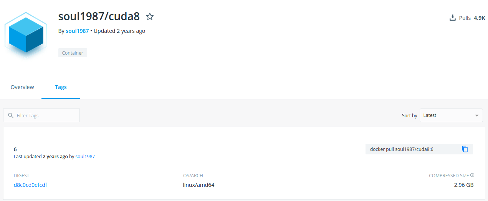

# Docker基本使用
## docker和nvidia-docker 安装
略  
安装后查看安装信息和测试docker是否安装正确
```bash
$ sudo docker --version
$ sudo docker run hello-world
# 验证nvidia-docker
$ docker run --runtime=nvidia --rm nvidia/cuda nvidia-smi
```
## docker hub
[链接:dockerhub](https://hub.docker.com/)  
在dockerhub上搜索自己需要的镜像
   
选择自己要用的镜像，点进去，点Tags会出现不同的版本  
   
复制命令，在终端中执行，就可以将镜像下载到本地
## docker基本命令
```bash
# 查看主机下有多少镜像
$ sudo docker images
# 删除镜像
$ sudo docker rmi <image_id>
# 查看主机下的容器,不加-a表示查看运行中的容器
$ sudo docker ps -a
# 启动、重启和停止容器
$ sudo docker start/restart/stop <container_id>
# 进入容器
$ sudo docker attach <container_id>
# 删除容器(需要先停止容器)
$ sudo docker rm <container_id>
```
ctrl+d退出并停止容器，ctrl+p+q退出但不停止容器
## 根据镜像新建并启动容器
```bash
$ sudo docker run -it [options] <image_id> bash
```
说明：-it为为容器分配一个输入终端，以交互式模式运行,bash为调用镜像里的bash  
可选选项：
```text
--name 为容器指定名字
-p 端口映射
-v 给容器挂载存储卷
--net 指定容器网络
--runtime=nvidia 可调用gpu
```
例如：
```bash
$ sudo docker run -it -p 8022:22 --name=tensorflow --runtime=nvidia -v /home/yu/code:/home --net=host ufoym/deepo bash
```
## 删除所有镜像和容器
```bash
$ sudo docker rmi `sudo docker images -q`
$ sudo docker rm `sudo docker ps -a -q`
```
## 导出容器和保存加载镜像
容器导出为镜像
```bash
# 容器导出为镜像
$ docker commit <continer_name> <image_name>
# 镜像导出为文件
$ docker save image_name> /dir/name.tar
# 文件导入为镜像
$ docker load < /dir/filename
```

## docker和宿主机的文件拷贝
```bash
  $ docker cp <container_name>:/dir/filename /hostdir/
  $ docker cp /hostdir/filename <container_name>:/dir
```
不管容器有没有启动，拷贝命令都会生效


